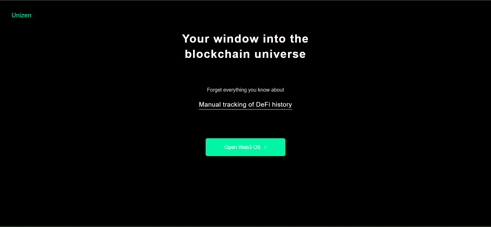

# ETH Balance Checker

## Table of Contents
  <br />

* [About the Project](#about-the-project)
* [Built With](#built-with)
* [Contributing](#contributing)
* [Contact](#authors)
* [Acknowledgements](#acknowledgements) 
* [Getting Started](#getting-started) 
* [Live Demo and Video](#live-version) 

#
<br />

 <br/>
 <br/>
 <br/>
 <br/>
 <br/>


<br />

### Built With

* [NEXT] [TYPESCRIPT] [WEBPACK] [JAVASCRIPT] [TAILWIND] [ETHERJS]

## Live Version

* [Live Demo](https://unizen-eth-tp.vercel.app/) 

<!-- ABOUT THE PROJECT   -->
## About The Project
The unizen demo app allows you to fetch native balances, stock balances and token balances from the Ethereum blockchain. The app is built with NextJS, Typescript, TailwindCSS, and EtherJS.

## Screenshot Test

<p align="center">
  
</p>


## Contributing

Contributions make the open-source community such an amazing place to learn, inspire, and create. Any contributions you make are **greatly appreciated**.

## Prerequisites

Terminal or similar to execute the program.


## Getting Started


## Clone project

- To get a local copy up and running follow these simple example steps.
- Clone this repository with git clone ```https://github.com/sergiocortessat/unizen-eth-tp``` using your terminal or command line.
- Change to the project directory by entering: ```cd unizen-eth-tp``` in the terminal.
- Enter the project folder and set the repo with its correspondent using npm install.
- After this run the command npx run start
- If the project cant be build, please run npx webpack.

## Command line steps
```
- $ git clone `$ git clone https://github.com/sergiocortessat/unizen-eth-tp
- $ cd scs-unizen-eth-tp
- $npm i
- $ npm run dev
- ##(If project doesn't build, please run): $ npx webpack
```

## Authors

👤 Sergio Cortes Satizabal

- Github: [@sergiocortessat](https://github.com/sergiocortessat)
- Twitter: [@sergiocortessat](https://twitter.com/sergiocortessat)
- LinkedIn: [@sergiocortessat](https://www.linkedin.com/in/sergio-cortes-satizabal-3b452194/)


<!-- ACKNOWLEDGEMENTS -->
## Acknowledgements


## 📝 License

This project is [MIT](https://github.com/sergiocortessat/sergiocortessat/blob/main/LICENSE) licensed.

